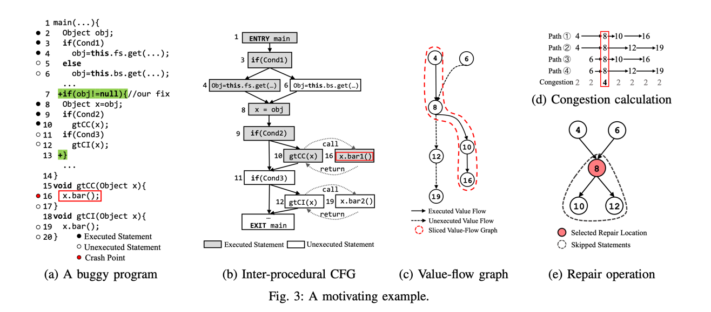
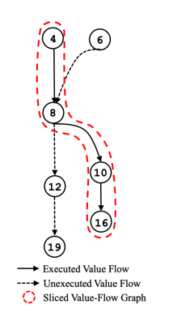
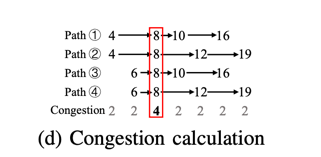

# VFix: Value-Flow-Guided Precise Program Repair for Null Pointer Dereferences

**Link**: https://ieeexplore.ieee.org/document/8812101

**Year**: 2019

**Notes**: Covers section I and II.

## Notes:

* Uses value flow analysis to identify the root cause of NPE
* Requires test cases to be present



Some notation:

* LOC = statement

```
L_dyn: executed statements that are executed by NPE causing test case

L_sta: static statements (variables, methods etc)

```

VFix generates patch in line 7 and 13 as follows:

### Step 1: Construct a value flow graph (VFG)



### Step 2: Selecting and Ranking Repair Locations

VFix collects the statements that are in the intersection of L_dyn and L_sta. 

Then it ranks them based on value flow congestion calculation.



The statement (LOC) with highest congestion value, ie `l_8` is selected as the repair location.

### Step 3: Applying Value-Flow-Aware Repair Operations.

Using value flow information, VFix finds all the LOCs that depends on the selected repair location (in this case `l_8`).

VFix sees that `l_10` and `l_12` are dependent on `l_8`, so it applies null check that encompasses `l_8 : l_12`.